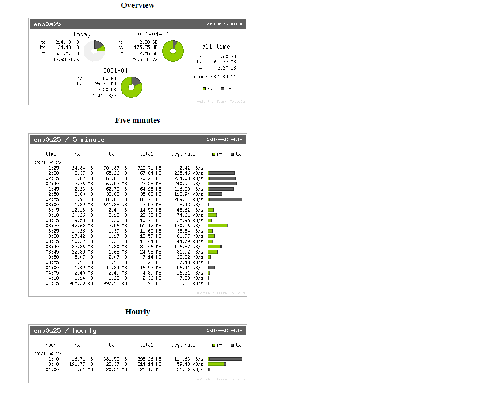

# VNStati

Setup vnstat and vnstati so we can generate picture graphs every X minute for monitor our server bandwidth

# Preview

# Install vnstat/vnstad/vnstati

### Gentoo

    emerge --ask vnstat
    vim ./vnstatd
    vim ./vnstat.conf
    cp vnstad /etc/conf.d/
    cp vnstat.conf /etc/

# Server:

- Edit 'vnstati-generate.sh' - Set active network interfrace under interface, use below command for print active nic:

      ip addr | awk '/state UP/ {print $2}' | sed 's/.$//'

- Add below line to cronie:

      0 * * * * /path/vnstati-generate.sh

- Create a folder in your webroot and copy index.html into it:

      mkdir -p /var/www/localhost/htdocs/vnstati
      cp ./index.html /var/www/localhost/htdocs/vnstati/

- Execute script manually for create your pictures:

      bash /var/www/localhost/htdocs/vnstati

- Browse to http://server/vnstati

#### REQUIREMENTS

A webserver and a linux enviroment with prefered webserver :) 

#### CONTACT 

If you have problems, questions, ideas or suggestions please contact me by posting to wuseman@nr1.nu

#### WEB SITE

Visit my websites and profiles for the latest info and updated tools

https://github.com/wuseman/ && https://nr1.nu && https://stackoverflow.com/users/9887151/wuseman

#### END!

